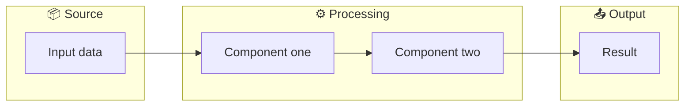

# README Section Templates

## Header block

```markdown
<p align="center">
  
</p>

<h1 align="center">Project Name</h1>

<p align="center">
  <a href="..."></a>
  <a href="..."></a>
  <a href="..."></a>
</p>
```

Use a `<picture>` tag instead of a plain `` if the SVG needs theme-aware rendering (light/dark mode support).

## Identity paragraph

One or two sentences. The first sentence answers *what is this?* The second answers *why should I care?*

```markdown
Project is a [category] for [audience] that [unique value]. It [key differentiator compared to alternatives].
```

Then a short bullet list of capabilities, 3–5 items max:

```markdown
- **Capability one** — Brief explanation.
- **Capability two** — Brief explanation.
- **Capability three** — Brief explanation.
```

## Quick Start

The fastest possible path from zero to visible result. Exactly one code block. Show the output.

````markdown
## Quick Start

**Prerequisites:** Python 3.13+, uv

```bash
# Install
uv add project-name

# Run
project-name do-something --input file.txt
```

Output:
```
✨ Result appears here
```
````

## Installation

List every supported method. Mark the recommended one.

```markdown
## Installation

**Recommended** — via pip / uv / npm:

```bash
...
```

<details>
<summary>Alternative methods</summary>

**From source:**

```bash
git clone https://github.com/user/project
cd project
make install
```

**Docker:**

```bash
docker pull user/project
```
</details>
```

## Usage

2–3 realistic scenarios, ordered from common to advanced. Each scenario has a heading, a code block, and a brief explanation of what the reader should notice.

```markdown
## Usage

### Basic scenario

```bash
project-name process input.csv
```

Processes the file and writes output to `output.csv`.

### With configuration

```bash
project-name process input.csv --format json --output-dir ./results
```

See [Configuration](#configuration) for all available options.
```

## Configuration reference

A table with option name, default, description, and example.

```markdown
## Configuration

| Option | Default | Description | Example |
|---|---|---|---|
| `--format` | `csv` | Output format | `json`, `yaml` |
| `--output-dir` | `./output` | Output directory | `./results` |
| `--verbose` | `false` | Enable verbose logging | `true` |
```

## Commands reference

A table listing every CLI command the project exposes.

```markdown
| Command | Description |
|---------|-------------|
| `serve` | Start the HTTP server |
| `build` | Compile assets |
| `check` | Run validation |
```

## Architecture diagram

A mermaid diagram that shows the system's components and data flow. Place it after the project structure or as a standalone section.

````markdown
## Architecture


````

Keep diagrams narrow (taller over wider) so they render well in constrained GitHub views. Prefer flowchart, sequence, or class diagrams — these render natively on GitHub.

## IDE / client configuration

If the project integrates with IDEs, clients, or platforms (MCP servers, VS Code extensions, CI), show concrete config for each supported platform.

```markdown
### Zed (`~/.config/zed/settings.json`)

```json
"context_servers": {
  "my-server": {
    "command": "uv",
    "args": ["run", "--directory", "/path/to/project", "my-server"]
  }
}
```

### opencode (`~/.config/opencode/profiles/default.json`)

```json
"mcpServers": {
  "my-server": {
    "command": "uv",
    "args": ["run", "--directory", "/path/to/project", "my-server"]
  }
}
```
```

## Troubleshooting

List common failure modes the reader is likely to encounter. Each item has a symptom, a cause, and a fix.

```markdown
| Symptom | Likely cause | Fix |
|---------|--------------|-----|
| `command not found` | Package not installed | Run `uv sync` to install the project |
| `Connection refused` | Server not running | Start the server first |
| `Bundle manifest missing` | Wrong bundle path | Point `--bundle` at the extracted directory |
```

## First-time walkthrough

A guided step-by-step from a fresh clone to a working setup. More detailed than Quick Start — includes preflight checks, smoke tests, and verification steps.

```markdown
## First-time build walkthrough

**Preflight.** Confirm the toolchain works:

```bash
uv sync
uv run doctor  # should report: all systems OK
```

**Smoke test (2 minutes).** Run a minimal end-to-end test:

```bash
uv run my-tool --limit 10 --output /tmp/smoke
```

**Full build (longer):**

```bash
uv run my-tool --output ./data/output
```

**Verify:**

```bash
uv run my-tool --check ./data/output
```
```

## Contributing

Brief instructions + link to CONTRIBUTING.md.

```markdown
## Contributing

See [CONTRIBUTING.md](CONTRIBUTING.md) for setup instructions, coding standards, and PR workflow.

This project adheres to a [Code of Conduct](CODE_OF_CONDUCT.md). By participating, you agree to its terms.
```

## License

```markdown
## License

[AGPL-3.0](LICENSE)
```

Link to the actual license file. Do not inline the full license text.
