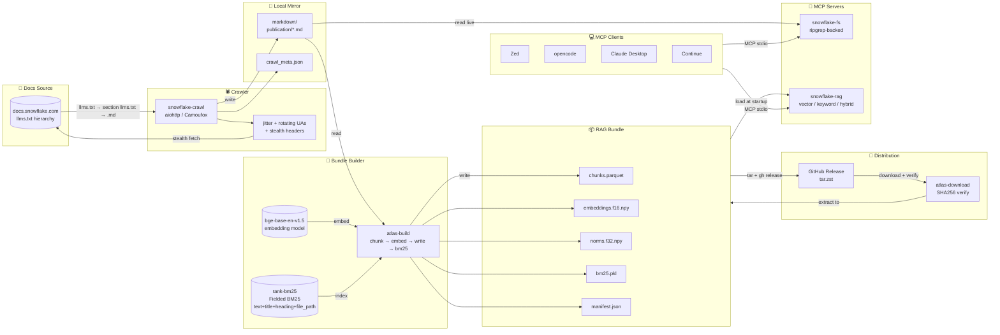

# Snowflake Atlas

*Local-first AI knowledge layer for Snowflake documentation via MCP.*

Atlas is a local-first knowledge layer for Snowflake development. Two
[Model Context Protocol](https://modelcontextprotocol.io) servers expose
the entire [Snowflake documentation](https://docs.snowflake.com/) to any AI agent:

- **snowflake-fs** — deterministic filesystem server backed by `ripgrep`. Tools:
  list publications, list files, read file, full-text search, get release info.
  No model, no embeddings, no state. ~zero startup.

- **snowflake-rag** — semantic search over precomputed embeddings plus
  fielded BM25 keyword search with title/heading/file-path weighting. Tools:
  search_docs, search_code, get_chunk, get_bundle_info. Three modes:
  `vector` (dense), `keyword` (fielded BM25), `hybrid` (score-level fusion).
  Loads a portable bundle once at startup (~1 GB); answers
  queries in ~1-2 ms (MLX on Apple Silicon) or ~50-200 ms (ONNX+CPU).

The RAG bundle is **built once** by the maintainer locally, then distributed
as a single download via `atlas-download`. End users never embed, never chunk,
never run a vector database, never pull a model.

---

## Table of contents

1. [Why two servers and not one?](#1-why-two-servers-and-not-one)
2. [Tech stack & rationale](#2-tech-stack--rationale)
3. [Project structure](#3-project-structure)
4. [For users: install and use](#4-for-users-install-and-use)
5. [For maintainers: building and releasing](#5-for-maintainers-building-and-releasing)
6. [Operating](#6-operating)
7. [Roadmap](#7-roadmap)
8. [Platform support & caveats](#8-platform-support--caveats)
9. [Troubleshooting](#9-troubleshooting)
10. [Development](#10-development)
11. [Validate RAG quality](#11-validate-rag-quality)
12. [Contributing](#contributing)
13. [License](#license)

---

## 1. Why two servers and not one?

A single RAG pipeline forces every consumer into a fixed retrieval
strategy and a fixed embedding model. Splitting into a filesystem
server and a RAG server buys:

- **Different strengths.** The filesystem server is unbeatable for
  "list the publications," "read this specific file," and "grep for
  the exact symbol." The RAG server is unbeatable for "find docs
  that talk about X" where the wording is fuzzy.
- **Different trust levels.** The filesystem server returns the
  verbatim markdown — no embedding can ever lie about it. The RAG
  server returns ranked candidates; the model should still verify
  with the filesystem server for anything load-bearing.
- **Different cost profiles.** The filesystem server is ~zero startup.
  The RAG server loads ~1 GB of vectors at startup but answers in
  ~100 ms. A smart client uses both: RAG to discover, FS to verify.
- **Different model fits.** A weak local model struggles with
  multi-hop FS navigation but does fine with RAG top-k. A
  strong external model can do either, and benefits from using both.

---

## 2. Tech stack & rationale

| Component | Choice | Why |
|-----------|--------|-----|
| **MCP transport** | Official Python `mcp` SDK (stdio) | The standard. Works in Zed, opencode, Claude Desktop, Continue, any MCP client. |
| **Filesystem search** | `ripgrep` subprocess | 10-100× faster than Python `re` over thousands of files. Single binary, well-maintained. |
| **Embedding model** | `Xenova/bge-base-en-v1.5` (ONNX) / `BAAI/bge-base-en-v1.5` (PyTorch) | 110M params, 768-dim, MTEB top-30. Pre-exported ONNX graph ships from HF. |
| **Inference runtime** | Layered: MLX → ONNX+CUDA → ONNX+CPU | Apple Silicon gets MLX (1-2 ms/query). Linux + NVIDIA gets ONNX+CUDA. Everything else gets ONNX+CPU. |
| **Vector store** | `numpy` `.npy` arrays | At 100k × 768 dims, a single matrix multiply is ~10-20 ms. FAISS is overkill. |
| **Chunk metadata** | `pyarrow` Parquet (snappy compressed) | Columnar, compressed, zero-copy reads. No pandas import overhead. |
| **Embedding dtype** | `float16` vectors, `float32` norms | Cosine similarity is rank-preserving under half precision. Halves bundle size. |
| **Tokenizer** | `transformers` `AutoTokenizer` | First-class support for BGE fast tokenizer. |
| **Docs source** | `https://docs.snowflake.com/llms.txt` | Official LLM-friendly markdown publication. Web-crawl mirrored. |
| **Chunking** | H2-boundary sections per markdown file + 150-char overlap between adjacent sections | Respects the docs' deliberate structure. Overlap catches boundary-spanning queries. |
| **Chunk metadata** | Includes `cluster_tags` — space-joined sibling stems in the same directory | Enables path-aware relevance boost at query time without re-embedding. |
| **Distribution** | GitHub Releases (per-tag) | Simple, free, CLI-friendly API. End users download with one command. |
| **Doc crawler** | aiohttp + optional Camoufox stealth | Async, rate-limited, with jitter and rotating User-Agent pool. See [crawler docs](#9-troubleshooting). |
| **Keyword search** (build-time) | `rank-bm25` BM25Okapi (fielded) | Indexed at bundle-build time from chunk texts + titles + headings + file paths with per-field weights (text=1.0, title=3.0, heading=2.0, file_path=2.5). Pickled state (~a few MB for 250k docs). Enables `keyword` and `hybrid` search modes. |
| **Re-ranking** (opt-in) | `BAAI/bge-reranker-v2-base` (MLX) or `cross-encoder/ms-marco-MiniLM-L6-v2` (ONNX) | 110M params (MLX), 22.7M params (ONNX). Auto-selects MLX on Apple Silicon, falls back to ONNX. Enabled with `--rerank`. |
| **Package management** | `uv` | Fast resolver, lockfile, virtualenv, build system. |

---

## 3. Project structure

```
snowflake-atlas/
├── README.md                                 This file
├── pyproject.toml                            uv-managed deps, console-script entry points
├── .gitignore
│
├── atlas/                                    Core Atlas package (importable as `atlas`)
│   ├── __init__.py                           Version + package docstring
│   ├── chunk.py                              H2-boundary markdown chunker
│   ├── log.py                                Structured logging via structlog
│   ├── fs_server.py                          Filesystem MCP server (ripgrep-backed)
│   ├── rag_server.py                         RAG MCP server (auto-selects backend)
│   ├── make_bundle.py                        Bundle builder (chunk → embed → write)
│   ├── download.py                           Bundle downloader + SHA256 verification
│   ├── backup.py                             Snapshot current bundle
│   ├── restore.py                            Roll back to a previous snapshot
│   ├── doctor.py                             Installation diagnosis + backend probe
│   ├── bm25_search.py                        BM25 keyword index (build-time, optional)
│   ├── smoke_test.py                         E2E validation (build + search)
│   ├── evaluate.py                           RAG quality (Precision@10, MRR)
│   ├── rerank.py                             Cross-encoder re-ranker (MiniLM-L6-v2 ONNX, portable)
│   ├── rerank_mlx.py                         Cross-encoder re-ranker (bge-reranker-v2-base MLX, Apple Silicon)
│   ├── embed/                                Embedding backends (factory pattern)
│   │   ├── __init__.py
│   │   ├── base.py                           ABC + factory + resolve_backend
│   │   ├── onnx.py                           OnnxEmbedder (portable, CPU/CUDA)
│   │   └── mlx.py                            MlxEmbedder (Apple Silicon)
│   └── sources/                              Source adapters for markdown input
│       ├── __init__.py
│       ├── base.py                           MarkdownSource ABC
│       ├── git.py                            Git repo source
│       ├── web_crawl.py                      Web crawl mirror source
│       └── local.py                          Local directory source
│
├── snowflake_docs_nav/                       Snowflake-specific doc crawler
│   ├── __init__.py
│   └── crawler.py                            Async llms.txt crawler with stealth
│
├── scripts/
│   └── publish-bundle.sh                     Local build + gh release create
│
├── tools/
│   ├── convert_bge_to_mlx.py                 Convert BGE embedder weights to MLX .npy
│   └── convert_reranker_to_mlx.py            Convert BGE reranker weights to MLX .npy
│
├── tests/
│   ├── __init__.py
│   ├── test_chunk.py                         Chunker tests
│   ├── test_embed.py                         Embedding backend tests
│   ├── test_bm25_search.py                   BM25 keyword index tests
│   ├── test_fs_server.py                     FS MCP server tests
│   ├── test_rag_server.py                    RAG MCP server tests
│   ├── test_sources.py                       Source adapter tests
│   ├── test_backup_restore.py                Backup/restore tests
│   ├── test_doctor.py                        Doctor diagnosis tests
│   └── test_download.py                      Bundle download tests
│
├── data/                                     Runtime data (gitignored, created at runtime)
```

---

## 4. For users: install and use

### 4.1 Prerequisites

- **Python 3.11+** (3.12 or 3.13 recommended).
- **[`uv`](https://docs.astral.sh/uv/)** for Python environment management.
- **[`ripgrep`](https://github.com/BurntSushi/ripgrep)** (`brew install ripgrep` or `apt install ripgrep`).
- ~1.5 GB of free disk for the bundle.

> **Platforms.** Atlas runs on three classes of host, each picking a
> different embedding backend by default:
>
> - **Apple Silicon (M1/M2/M3/M4).** Default backend is MLX, which talks
>   to the Apple Neural Engine directly. ~1-2 ms per query. Install with
>   `uv sync --extra mlx`.
> - **Linux x86_64 with an NVIDIA GPU.** Default backend is ONNX Runtime + CUDA.
>   ~1-2 ms per query. Install with `uv sync --extra gpu`.
> - **Anything else** falls back to ONNX+CPU. ~50-200 ms per query.

### 4.2 Install

```bash
git clone <this-repo-url> snowflake-atlas
cd snowflake-atlas
uv sync
```

**Optional extras** (pick what your machine can use):

```bash
# Apple Silicon: MLX embedder
uv sync --extra mlx

# Linux with NVIDIA GPU: ONNX Runtime + CUDA
uv sync --extra gpu

# Both
uv sync --extra mlx --extra gpu
```

> **Re-applying extras on subsequent `uv sync`.** `uv sync` synchronizes
> the venv to match the lockfile plus whichever extras you specify on the
> command line. If you later run plain `uv sync`, the MLX/GPU packages
> will be silently removed. Keep them by re-running with the same flags:
> `uv sync --extra mlx`. After a sync, `atlas-doctor` will tell you
> immediately if a previously-installed backend is now MISS.

### 4.3 Download the pre-built bundle

```bash
uv run atlas-download \
  --repo <owner>/snowflake-atlas \
  --output ./data/snowflake-rag-bundle
```

This downloads, verifies SHA256, and extracts the bundle. If a previous
bundle exists, it's snapshotted into `./data/snowflake-rag-bundle/.backups/`
first (most recent 5 kept by default).

Pin to a specific release:

```bash
uv run atlas-download \
  --repo <owner>/snowflake-atlas \
  --tag v2026.07 \
  --output ./data/snowflake-rag-bundle
```

### 4.4 Get the docs mirror (for filesystem server)

Download the pre-crawled mirror from GitHub Releases:

```bash
uv run atlas-download \
  --repo <owner>/snowflake-docs-mirror \
  --output ./data/snowflake-docs
```

Or crawl it yourself (see [§5.1](#51-crawl-snowflake-documentation)).

### 4.5 Configure your IDE

Both servers speak MCP over stdio, so any client that supports
[the standard](https://modelcontextprotocol.io) works: Zed, opencode,
Claude Desktop, Continue, and others.

#### Zed (`~/.config/zed/settings.json`)

```json
"context_servers": {
  "snowflake-fs": {
    "command": "uv",
    "args": [
      "run", "--directory", "/absolute/path/to/snowflake-atlas",
      "snowflake-fs", "--source-type", "web-crawl", "--mirror-path", "/absolute/path/to/data/snowflake-docs"
    ],
    "timeout": 60
  },
  "snowflake-rag": {
    "command": "uv",
    "args": [
      "run", "--directory", "/absolute/path/to/snowflake-atlas",
      "snowflake-rag", "--bundle", "/absolute/path/to/data/snowflake-rag-bundle", "--prefer", "auto"
    ],
    "timeout": 120
  }
}
```

> **Search mode** is configured per-query via the `mode` parameter
> (`vector`, `keyword`, or `hybrid`) on each `search_docs`/`search_code`
> call. See [Search Modes](#search-modes).

#### opencode (`~/.config/opencode/profiles/default.json`)

```json
"mcpServers": {
  "snowflake-fs": {
    "command": "uv",
    "args": [
      "run", "--directory", "/absolute/path/to/snowflake-atlas",
      "snowflake-fs", "--source-type", "web-crawl", "--mirror-path", "/absolute/path/to/data/snowflake-docs"
    ]
  },
  "snowflake-rag": {
    "command": "uv",
    "args": [
      "run", "--directory", "/absolute/path/to/snowflake-atlas",
      "snowflake-rag", "--bundle", "/absolute/path/to/data/snowflake-rag-bundle", "--prefer", "auto"
    ]
  }
}
```

#### Claude Desktop (`~/.config/Claude/claude_desktop_config.json`)

```json
{
  "mcpServers": {
    "snowflake-fs": {
      "command": "uv",
      "args": [
        "run", "--directory", "/absolute/path/to/snowflake-atlas",
        "snowflake-fs", "--source-type", "web-crawl", "--mirror-path", "/absolute/path/to/data/snowflake-docs"
      ]
    },
    "snowflake-rag": {
      "command": "uv",
      "args": [
        "run", "--directory", "/absolute/path/to/snowflake-atlas",
        "snowflake-rag", "--bundle", "/absolute/path/to/data/snowflake-rag-bundle", "--prefer", "auto"
      ]
    }
  }
}
```

### 4.6 Quick CLI sanity check

```bash
# Confirm both servers start
uv run snowflake-fs --help
uv run snowflake-rag --help

# Run diagnosis
uv run atlas-doctor

# Run smoke test
uv run atlas-smoke \
  --bundle ./data/snowflake-rag-bundle \
  --source-type web-crawl \
  --mirror-path ./data/snowflake-docs
```

---

## 5. For maintainers: building and releasing

### 5.0 First-time build walkthrough

A guided path for building the bundle on your own machine, from a
fresh `uv sync` to a working bundle.

**Preflight.** Confirm the embedding backend you expect is available:

```bash
uv sync --extra mlx        # or --extra gpu on Linux + NVIDIA
uv run atlas-doctor        # should report: MLX OK, selected: mlx
```

**Convert MLX weights (2 minutes, one-time).** The MLX backend needs
pre-converted weight files. This uses PyTorch temporarily to read the
Hugging Face checkpoint and write 197 ``.npy`` files to the MLX cache.

```bash
uv pip install torch
uv run python tools/convert_bge_to_mlx.py
uv pip uninstall torch --yes
```

The tokenizer (``transformers.AutoTokenizer``) works without PyTorch —
the warning about "PyTorch was not found" is harmless. PyTorch is only
needed for this one-time weight conversion.

**Smoke crawl (2 minutes).** Test the crawler with a single section:

```bash
# Use `uv run` to invoke the command within the project's virtual environment
uv run python -m snowflake_docs_nav.crawler \
  --output ./data/snowflake-docs \
  --sections cortex-ai \
  --max-pages 20 \
  --stealth
```

**Smoke build (2 minutes).** Test the pipeline with a tiny bundle:

```bash
uv run atlas-build \
  --source-type web-crawl \
  --mirror-path ./data/snowflake-docs \
  --output /tmp/atlas-smoke \
  --limit 100 \
  --prefer apple
```

**Sanity-check the smoke bundle:**

```bash
.venv/bin/python -c "
from atlas.rag_server import Bundle
b = Bundle('/tmp/atlas-smoke', prefer='apple')
hits = b.search('Snowflake Cortex AI', top_k=3)
for h in hits:
    print(f'  {h[\"score\"]:.3f}  {h[\"file\"]} :: {h[\"heading\"]}')
"
```

Using `.venv/bin/python` directly avoids the ~300 ms `uv run` overhead.
For pure JSON inspection of the manifest:

```bash
jq . /tmp/atlas-smoke/manifest.json | head -20
```

**Full crawl (~30 minutes):**

```bash
uv run python -m snowflake_docs_nav.crawler \
  --output ./data/snowflake-docs \
  --stealth
```

**Full build (2-4 hours depending on hardware):**

```bash
uv run atlas-build \
  --source-type web-crawl \
  --mirror-path ./data/snowflake-docs \
  --output ./data/snowflake-rag-bundle \
  --prefer auto
```

### 5.1 Crawl Snowflake documentation

The crawler fetches every `.md` page listed in the `llms.txt` hierarchy
across all ~30 documentation sections.

```bash
# Full crawl (~6,800 pages, ~30 min)
uv run python -m snowflake_docs_nav.crawler --output ./data/snowflake-docs

# Stealth mode (rotating UAs, jitter, realistic headers)
uv run python -m snowflake_docs_nav.crawler --output ./data/snowflake-docs --stealth

# Test with subset
uv run python -m snowflake_docs_nav.crawler --output ./data/snowflake-docs --sections cortex-ai,sql-functions --max-pages 50

# Camoufox browser engine (slowest but most stealthy)
uv run python -m snowflake_docs_nav.crawler --output ./data/snowflake-docs --engine camoufox
```

The crawler saves files to `markdown/<publication>/<path>.md` and writes
a `crawl_meta.json` with source URL, timestamp, and crawler SHA.

Useful flags:
- `--stealth` — enables rotating User-Agent pool, jittered delays, and consistent browser headers
- `--engine camoufox` — uses Camoufox (stealth Firefox) instead of aiohttp
- `--sections cortex-ai,sql-functions` — crawl only specific sections
- `--max-pages 100` — limit total pages fetched
- `--delay-min 0.5 --delay-max 2.0` — control jitter range (default: 0.3-1.5s)

### 5.1.5 MLX weight conversion (Apple Silicon)

The MLX backend requires pre-converted weights from the PyTorch
checkpoint. This is a **one-time step per machine** — once the
``.npy`` files are in the cache, every build and query reuses them.

```bash
# Install torch temporarily for the conversion
uv pip install torch

# Run the conversion (writes to ~/.cache/atlas/models/bge-base-en-v1.5-mlx/)
uv run python tools/convert_bge_to_mlx.py

# Uninstall torch — not needed at runtime
uv pip uninstall torch --yes
```

The conversion reads ``BAAI/bge-base-en-v1.5`` (the PyTorch model)
and writes 197 ``.npy`` weight files. The MLX embedder then loads
them at ``~/.cache/atlas/models/bge-base-en-v1.5-mlx/`` and never
touches PyTorch again.

After conversion, ``atlas-doctor`` reports ``MLX OK, selected: mlx``
and ``atlas-build --prefer apple`` will use the ANE/GPU accelerator.

> **Note:** If the MLX cache is empty, ``atlas-build --prefer apple``
> falls back gracefully to ONNX+CPU with a reminder to run the
> conversion script. ONNX+CPU is ~3-5x slower but works without any
> setup.

### 5.2 Build RAG bundle

The build pipeline runs: crawl → chunk (with overlap + cluster_tags) →
embed → fielded BM25 index (text + title + heading + file_path) →
write artifacts → stage model → manifest.

```bash
# Full build
uv run atlas-build \
    --source-type web-crawl \
    --mirror-path ./data/snowflake-docs \
    --output ./data/snowflake-rag-bundle \
    --prefer auto

# Test build (skip embeddings, limit files)
uv run atlas-build \
    --source-type web-crawl \
    --mirror-path ./data/snowflake-docs \
    --output ./data/test-bundle \
    --limit 100 \
    --skip-embed
```

The build writes a `manifest.json` with the source SHA, chunk count,
BM25 index size, model ID, and SHA256 of each artifact. A **fielded
BM25 index** is built automatically from chunk texts, titles, headings,
and file paths with per-field weights (text=1.0, title=3.0, heading=2.0,
file_path=2.5) via `rank-bm25::BM25Okapi` and saved as `bm25.pkl`.

### 5.3 Validate

```bash
# Run smoke tests
uv run atlas-smoke \
    --bundle ./data/snowflake-rag-bundle \
    --source-type web-crawl \
    --mirror-path ./data/snowflake-docs \
    --verbose

# Diagnose installation
uv run atlas-doctor --bundle ./data/snowflake-rag-bundle
```

### 5.4 Publishing a release

The bundle is built locally — embedding ~100k chunks on a CI runner is
impractical. On Apple Silicon with MLX the build takes ~30 min; on a
CPU-only machine it takes longer but still finishes.

```bash
# Prerequisites: gh CLI installed and authenticated
#   brew install gh && gh auth login

# Publish the existing bundle (fast, no rebuild)
./scripts/publish-bundle.sh <owner>/snowflake-atlas

# Or rebuild first (takes ~30 min on Apple Silicon)
./scripts/publish-bundle.sh --rebuild <owner>/snowflake-atlas
```

This tars the bundle, creates a GitHub Release tagged `vYYYY.MM`, and
uploads it. Users can then install it with `atlas-download`.

The script lives at `scripts/publish-bundle.sh` — read it to see exactly
what it does before running.

### 5.4.5 MLX reranker weight conversion (Apple Silicon)

The MLX cross-encoder reranker (`atlas/rerank_mlx.py`) requires
pre-converted weights from the Hugging Face checkpoint. This is a
**one-time step per machine**, like the embedder MLX conversion.

```bash
# Install torch temporarily for the conversion
uv pip install torch

# Run the conversion (writes to ~/.cache/atlas/models/bge-reranker-v2-base-mlx/)
uv run python tools/convert_reranker_to_mlx.py

# Uninstall torch — not needed at runtime
uv pip uninstall torch --yes
```

The conversion reads `BAAI/bge-reranker-v2-base` (a BERT-base cross-encoder)
and writes 199 ``.npy`` weight files (197 encoder weights + classifier
head weight/bias). The MLX reranker loads them at
``~/.cache/atlas/models/bge-reranker-v2-base-mlx/``.

After conversion, the RAG server auto-selects MLX for reranking when
`--rerank` is passed, falling back to ONNX if MLX weights aren't found.

### 5.5 Smoke-test the bundle

After building or downloading a bundle, validate it end-to-end:

```bash
uv run atlas-smoke \
  --bundle ./data/snowflake-rag-bundle \
  --source-type web-crawl \
  --mirror-path ./data/snowflake-docs
```

The smoke test confirms the bundle loads, embeddings are queryable, and
the filesystem server can serve files from the mirror.

---

## Architecture



---

## 6. Operating

### 6.1 Update to the latest bundle

```bash
uv run atlas-download --repo <owner>/snowflake-atlas --output ./data/snowflake-rag-bundle
```

The current bundle is auto-snapshotted before being replaced. If the new
bundle is broken, the IDE still works against the old directory while
you sort it out.

### 6.2 List and roll back

```bash
uv run atlas-restore --bundle ./data/snowflake-rag-bundle --list

uv run atlas-restore --bundle ./data/snowflake-rag-bundle  # latest
uv run atlas-restore --bundle ./data/snowflake-rag-bundle --from snapshot-20260701T120000Z.tar.gz
```

`atlas-restore` snapshots the current bundle as a safety net before
swapping, so you can always go back one more step.

### 6.3 Manual snapshot

```bash
uv run atlas-backup --bundle ./data/snowflake-rag-bundle --keep 5
```

### 6.4 Diagnose with `atlas-doctor`

```bash
uv run atlas-doctor
uv run atlas-doctor --bundle ./data/snowflake-rag-bundle
uv run atlas-doctor --refresh
uv run atlas-doctor --json
```

Output (short form):

```
Platform       : Darwin 24.5.0 (arm64)
Python         : 3.13.5
ONNX Runtime   : 1.26.0  providers: ['CoreMLExecutionProvider', 'CPUExecutionProvider']

Backend probe:
  ONNX+CPU       OK  always available
  Apple MLX      OK   weights cached
  NVIDIA CUDA    MISS nvidia-smi not on PATH

Selected       : mlx
                Apple Silicon detected and MLX is importable

Bundle         : /Users/me/data/snowflake-rag-bundle
                manifest=OK chunks=OK embeddings=OK
                52 chunks, model=Xenova/bge-base-en-v1.5 (SHA ok)
```

`atlas-doctor` is non-destructive and never blocks startup. Run it first
when something is wrong.

---

## Commands Reference

| Command | Description |
|---------|-------------|
| `snowflake-fs` | Filesystem MCP server (ripgrep-based) |
| `snowflake-rag` | RAG MCP server (vector, fielded BM25 keyword, hybrid search) |
| `atlas-build` | Build RAG bundle from source |
| `atlas-download` | Download bundle from GitHub Releases |
| `atlas-backup` | Snapshot current bundle |
| `atlas-restore` | Roll back to snapshot |
| `atlas-smoke` | Run E2E smoke tests |
| `atlas-doctor` | Diagnose installation + backend |
| `atlas-evaluate` | Evaluate RAG quality (P@10, MRR) |
| `snowflake-crawl` | Crawl Snowflake docs to local mirror |

---

## Backend Selection

| Platform | Default Backend | Override |
|----------|----------------|----------|
| Apple Silicon (M1/M2/M3/M4) | MLX (~1-2 ms/query) | `--prefer cpu` |
| Linux + NVIDIA GPU | ONNX+CUDA (~1-2 ms/query) | `--prefer cpu` |
| Everything else | ONNX+CPU (~50-200 ms/query) | N/A |

The backend is resolved at **run time** (not build time). The same bundle
works everywhere. Use `atlas-doctor` to see which backend will be selected.

Override examples:

```bash
# Always MLX, even on a machine that would default to CUDA
uv run snowflake-rag --prefer apple

# Force the portable floor (useful for debugging)
ATLAS_EMBED_BACKEND=cpu uv run snowflake-rag
```

---

## Search Modes

The `snowflake-rag` server supports three search modes, selected via the
`mode` parameter on each `search_docs`/`search_code` call:

| Mode | How it works | Best for |
|------|-------------|----------|
| `hybrid` (default) | Score-level fusion (0.6 × vector + 0.4 × normalised BM25) | Maximum recall — catches what either method misses |
| `vector` | Cosine similarity on dense embeddings only | General-purpose semantic search |
| `keyword` | Fielded BM25Okapi (body + title + heading + file-path scoring with per-field weights) | Exact identifier lookups (SQL functions, error codes, config options) |

**The mode is per-query**, so a client can use `keyword` for a SQL
function lookup (`TO_DATE`), `vector` for fuzzy concept search (`"how
do I set up RBAC"`), and `hybrid` (the default) when coverage matters most.

The BM25 index is built at bundle-build time. If a bundle lacks
`bm25.pkl` (older bundles), `keyword` and `hybrid` fall back to
a simple title-boost heuristic automatically — no crash, no error.

**Try the difference.** Point any of these at your built bundle:

```bash
# Hybrid — score-level fusion of vector + BM25 (best overall recall)
uv run python -c "
from atlas.rag_server import Bundle
b = Bundle('./data/snowflake-rag-bundle')
for r in b.search('how to set up RBAC', top_k=3, mode='hybrid'):
    print(f'  {r[\"score\"]:.3f}  {r[\"file\"]} :: {r[\"heading\"]}')
"

# Vector — pure dense embedding similarity
uv run python -c "
from atlas.rag_server import Bundle
b = Bundle('./data/snowflake-rag-bundle')
for r in b.search('how to set up RBAC', top_k=3, mode='vector'):
    print(f'  {r[\"score\"]:.3f}  {r[\"file\"]} :: {r[\"heading\"]}')
"

# Keyword — fielded BM25 (title/heading/file-path boosted, best for exact names)
uv run python -c "
from atlas.rag_server import Bundle
b = Bundle('./data/snowflake-rag-bundle')
for r in b.search('TO_DATE', top_k=3, mode='keyword'):
    print(f'  {r[\"score\"]:.3f}  {r[\"file\"]} :: {r[\"heading\"]}')
"
```

---

## Retrieval Enhancements

### Chunk Overlap

Adjacent H2 sections share a small text overlap (150 characters from the
tail of the previous section) so that queries straddling a section boundary
still match. The overlap is prepended without a special marker — the
embedding model treats it as natural context.

- Controlled via `_OVERLAP_CHARS` in `atlas/chunk.py` (default 150).
- Zero runtime cost — embedded at build time.
- Can cause adjacent sections to inherit code-fence flags (`is_code`), which
  is correct: a section that begins with a code snippet from overlap _is_
  relevant for `search_code`.

### Hierarchical File-System Chunking (Path-Aware Boost)

At build time, each chunk is tagged with `cluster_tags` — the space-joined
stems of sibling `.md` files in the same directory. At query time, the RAG
server applies a small relevance boost (`0.03` weight) to chunks whose
`cluster_tags` match query tokens.

This is a lightweight form of path-aware retrieval that surfaces related
docs from the same file-system "neighbourhood" without re-embedding.

- **Build-time:** sibling map computed in `make_bundle.py::build_chunk_table()`.
- **Query-time:** `pc.match_substring` on `cluster_tags` in `Bundle.search()`.
- **Graceful fallback:** old bundles without the column skip the boost.

### Cross-Encoder Reranker (opt-in)

The `--rerank` flag enables a cross-encoder re-ranker that re-scores the
top-100 candidates from hybrid search using a joint query-passage model.

- **MLX backend** (Apple Silicon): `BAAI/bge-reranker-v2-base` — 110M params,
  BERT-base encoder + classification head. Weights converted via
  `tools/convert_reranker_to_mlx.py`.
- **ONNX backend** (portable): `cross-encoder/ms-marco-MiniLM-L6-v2` —
  22.7M params, auto-downloaded from Hugging Face.
- Auto-selects MLX if available, falls back to ONNX.
- Adds ~5 ms/query (MLX) or ~50-200 ms (ONNX+CPU).

---

### Fielded BM25 with File-Path Signals

The keyword search index is built as a **fielded BM25** that scores matches
in the body text, title, heading, and file path independently, then combines
them as a weighted sum:

| Field | Weight | Why |
|-------|--------|-----|
| `text` (body) | 1.0 | Baseline — the main content |
| `heading` | 2.0 | Section headings summarise the chunk's topic |
| `file_path` | 2.5 | Filename stems like `create-warehouse` are expert-curated relevance tags |
| `title` | 3.0 | Document titles are concise human-written summaries |

BM25 parameters are tuned for long reference docs: `k1=2.0` (higher TF
saturation ceiling) and `b=0.7` (reduced length normalisation penalty).

The file-path field works because Snowflake's `.md` filenames are
descriptive identifiers — a query for "create warehouse" directly matches
the path tokens of `sql-reference/sql/create-warehouse.md`. The `.md`
extension is stripped before tokenization so only meaningful tokens remain.

- **Build-time:** `atlas/make_bundle.py` extracts the `file` column and
  passes it as the `file_path` field to `build_fielded_index()`.
- **Query-time:** `atlas/bm25_search.py::FieldedBM25Index` computes per-field
  scores and combines them — `rag_server.py` doesn't need to know about fields.
- **Persisted:** Fields and weights are baked into `bm25.pkl` (version 2
  format). Version 1 pickles still load via backward compatibility.
- **Cost:** Zero query-time LLM cost. Build-time overhead ~1-2 s for 250k
  chunks. Pickle increases ~100 KB for 50k chunks with 4 fields.

---

## Configuration

Create `~/.config/atlas.toml` to set default backend:

```toml
[backend]
prefer = "auto"  # or "apple", "nvidia", "cpu"
```

Or use environment variable:

```bash
export ATLAS_EMBED_BACKEND=apple
```

---

## 7. Roadmap

### Reasoning agent (`atlas/agent.py`, planned)

What it should eventually be:

- A thin local agent that wraps the two MCP servers for command-line
  use (`atlas-agent "find docs about Snowflake Cortex AI functions"`)
  for users who don't have an IDE with MCP support.
- Pre-built tool-use prompt templates tuned for Snowflake tasks
  (SQL reference lookup, Cortex AI configuration, migration planning).
- A planner that fans a question out to `snowflake-fs` + `snowflake-rag` in
  parallel and merges the results.

### Fine-tuning pipeline (`atlas/training.py`, planned)

- Dataset curation from the same RAG bundle used for retrieval.
- QLoRA adapters for local models, with evaluation against MCP tool-calling contracts.

---

## 8. Platform support & caveats

### Supported

- **Apple Silicon (M1/M2/M3/M4), all macOS versions with current
  security updates.** MLX is the default backend on this hardware
  (`uv sync --extra mlx` to install).
- **Linux x86_64 + CPU.** The portable ONNX+CPU floor works everywhere.
- **Linux x86_64 + NVIDIA GPU.** ONNX+CUDA via `uv sync --extra gpu`.

### Not supported

- **Intel Macs.** Falls back to ONNX+CPU. No MLX acceleration.
- **Windows.** `mcp` and `onnxruntime` work on Windows, but `rg` and
  `tar` paths are untested.

### Known limitations

- The embedder's `max_seq_length` is 512 tokens. Chunks larger than
  that are silently truncated. The H2 chunker rarely produces such
  chunks, but the `chunk._hard_split` fallback handles them.
- Chunk overlap can cause adjacent sections to inherit code-fence flags
  (`is_code = True`) when the overlap text carries a code fence from the
  previous section. This is correct behaviour: sections near code are
  relevant for `search_code`.
- Cosine scores are not calibrated. A score of 0.7 is only meaningful
  relative to other scores from the same query. Use `min_score` loosely.
- The bundle targets a single snapshot of Snowflake docs. Re-build
  periodically to stay current.

---

## 9. Troubleshooting

### `No 'markdown/' directory at ...`

The filesystem server was started with `--mirror-path` pointing at
the wrong place. The expected layout is
`<mirror>/markdown/<publication>/*.md`. If you haven't crawled yet:

```bash
uv run python -m snowflake_docs_nav.crawler --output ./data/snowflake-docs
```

### `Bundle manifest missing`

Either `--bundle` points at the wrong directory, or the bundle wasn't
extracted cleanly. Re-run `atlas-download` and let it overwrite.

### `ripgrep (rg) not installed`

```bash
brew install ripgrep        # macOS
apt install ripgrep         # Debian/Ubuntu
```

### `Context server requires timeout` in Zed/opencode

The first RAG query after server startup pays a one-time warmup cost:
~3-5 s for ONNX+CPU, ~1 s for MLX. Raise the MCP `timeout` to 120 or
300 seconds to absorb the warmup.

### `atlas-doctor` says MLX is MISS but I have an M-series

You didn't install the optional MLX extra. Run:

```bash
uv sync --extra mlx
```

After that, `atlas-doctor` will find MLX and it becomes the default.

### Search returns nothing useful

1. Run `get_bundle_info` to confirm the bundle is loaded.
2. Try `search_docs` with a broader query.
3. Use `snowflake-fs` to grep for exact terms.
4. Drop `min_score` to 0.0 to see all candidates.

### Crawler gets rate-limited

The crawler has two stealth layers:

```bash
# Basic stealth: rotating UAs + jitter
uv run python -m snowflake_docs_nav.crawler --output ./data/snowflake-docs --stealth

# Maximum stealth: Camoufox browser engine
uv run python -m snowflake_docs_nav.crawler --output ./data/snowflake-docs --engine camoufox
```

If you're still getting rate-limited, increase the jitter range:

```bash
uv run python -m snowflake_docs_nav.crawler --output ./data/snowflake-docs --stealth --delay-min 1.0 --delay-max 3.0
```

### Console scripts not found after `uv sync`

If `uv run snowflake-fs --help` returns "command not found," the package
isn't installed in the venv. Run `uv sync` (no flags) to install the
project itself, not just its dependencies.

---

## 10. Development

### Useful shell recipes

```bash
# Pretty-print the bundle manifest (no `cat`, no `uv run` overhead)
jq . data/snowflake-rag-bundle/manifest.json

# If you don't have jq, fall back to stdlib
.venv/bin/python -m json.tool data/snowflake-rag-bundle/manifest.json | head -20

# Load a bundle in Python without going through `uv run`
.venv/bin/python -c "
from atlas.rag_server import Bundle
b = Bundle('data/snowflake-rag-bundle', prefer='apple')
for h in b.search('Snowflake tasks', top_k=3):
    print(f'{h["score"]:.3f}  {h["file"]}')
"
```

Install `jq` once (`brew install jq` on macOS, `apt install jq` on
Linux) and the first command is the one you'll reach for every time.

### Lint

ruff enforces style *and* docstring conventions (pydocstyle rules are
enabled via `"D"` in `pyproject.toml`):

```bash
uv run ruff check .
# Auto-fix trivial issues (blank lines, punctuation):
uv run ruff check --fix .
```

The ``atlas/`` package is fully clean (zero violations). 216 remaining
D violations are in ``tests/`` and ``tools/`` only. Codacy's Pylint
runner flags the same gaps; fixing them locally cuts dashboard noise.
See ``pyproject.toml`` for the full rule set.

### Run unit tests

```bash
uv run pytest tests/ -v
```

Runs the full test suite (chunker, embedder, MCP servers, bundle build,
BM25 keyword index).

### Run the smoke test

```bash
uv run atlas-smoke \
  --bundle ./data/snowflake-rag-bundle \
  --source-type web-crawl \
  --mirror-path ./data/snowflake-docs
```

### Add a new tool

1. Add a `Tool(...)` entry in `atlas/fs_server.py` or `atlas/rag_server.py`.
2. Add a handler branch in `call_tool`.
3. Keep the handler synchronous (it's already running in the async
   event loop; `asyncio.to_thread` is fine for blocking I/O).

### Change the embedder

Edit `embed.DEFAULT_MODEL_ID` and `embed.EMBEDDING_DIM`. The bundle build
and the runtime server read both. Changing embedding models invalidates
all existing bundles.

### Change the chunker

Edit `atlas/chunk.py`. The schema is documented in the module docstring.
Run `atlas-smoke` after changes. Key parameters:
- `_OVERLAP_CHARS` (150) — tail chars carried between adjacent H2 sections
- `_MAX_CHUNK_CHARS` (8000) — hard-split threshold for oversized sections

### Add a reranker

Two paths exist:
- **MLX (Apple Silicon):** Add a model class in `atlas/rerank_mlx.py` and a
  converter in `tools/convert_reranker_to_mlx.py`. The BERT-base architecture
  is already supported via `atlas/embed/mlx.BgeModel`.
- **ONNX (portable):** Export a Hugging Face cross-encoder to ONNX and add a
  `CrossEncoderReranker` subclass in `atlas/rerank.py`. Registration is
  automatic via the try/except in `rag_server.py`.

---

## 11. Validate RAG quality

The project ships a golden set of queries covering the major Snowflake
documentation areas (warehouses, Cortex AI, Snowpipe, dynamic tables,
security, Iceberg, search optimization, etc.). To evaluate retrieval quality:

```bash
# Vector search (cosine similarity on dense embeddings)
uv run atlas-evaluate \
  --bundle ./data/snowflake-rag-bundle \
  --golden ./data/golden_set.jsonl \
  --prefer apple \
  --top-k 5

# With cross-encoder re-ranker (more accurate, slower)
uv run atlas-evaluate \
  --bundle ./data/snowflake-rag-bundle \
  --golden ./data/golden_set.jsonl \
  --prefer apple \
  --top-k 5 \
  --rerank

# Compare keyword vs vector on a specific query:
uv run python -c "
from atlas.rag_server import Bundle
b = Bundle('./data/snowflake-rag-bundle', prefer='apple')
for mode in ('keyword', 'vector', 'hybrid'):
    print(f'--- {mode} ---')
    for r in b.search('how to create a virtual warehouse', top_k=5, mode=mode):
        print(f'  {r[\"score\"]:.3f}  {r[\"file\"]}')
"
```

This measures **Precision@k** (fraction of top-k results matching expected
files) and **Mean Reciprocal Rank** (inverse rank of first relevant result)
over the full golden set.

Add `--rerank` to use the cross-encoder re-ranker (slower but more
accurate — re-scores top-100 candidates with a joint query-passage model).
Uses MLX on Apple Silicon, ONNX elsewhere. Add `--output results.json`
to save results to a file.

The golden set is to be placed at `data/golden_set.jsonl`. Example:

```jsonl
{"query": "how to create a virtual warehouse in snowflake", "expected_files": ["user-guide/warehouses.md", "sql-reference/sql/create-warehouse.md", "user-guide/warehouses-tasks.md"], "expected_publications": ["markdown"]}
{"query": "snowflake cortex agents setup and configuration", "expected_files": ["user-guide/snowflake-cortex/cortex-agents-setup.md", "user-guide/snowflake-cortex/cortex-agents.md"], "expected_publications": ["markdown"]}
{"query": "loading data with snowpipe", "expected_files": ["user-guide/data-load-snowpipe-intro.md", "user-guide/data-load-snowpipe-rest-load.md", "user-guide/data-load-snowpipe-auto-s3.md"], "expected_publications": ["markdown"]}
{"query": "dynamic tables overview and use cases", "expected_files": ["user-guide/dynamic-tables/overview.md", "user-guide/dynamic-tables/create.md", "user-guide/dynamic-tables/refresh-modes.md"], "expected_publications": ["markdown"]}
{"query": "snowflake access control and roles", "expected_files": ["user-guide/security-access-control-overview.md", "user-guide/security-access-control-configure.md"], "expected_publications": ["markdown"]}
{"query": "time travel and fail-safe in snowflake", "expected_files": ["user-guide/data-time-travel.md", "user-guide/data-availability.md", "user-guide/data-failsafe.md"], "expected_publications": ["markdown"]}
{"query": "sharing data across snowflake accounts", "expected_files": ["user-guide/data-sharing-intro.md", "user-guide/data-sharing-provider.md", "user-guide/data-sharing-gs.md"], "expected_publications": ["markdown"]}
{"query": "cortex search hybrid search", "expected_files": ["user-guide/snowflake-cortex/cortex-search/cortex-search-overview.md", "user-guide/snowflake-cortex/cortex-search/query-cortex-search-service.md"], "expected_publications": ["markdown"]}
{"query": "vector embeddings snowflake", "expected_files": ["user-guide/snowflake-cortex/vector-embeddings.md", "user-guide/snowflake-cortex/cortex-rest-api/embed-api.md"], "expected_publications": ["markdown"]}
{"query": "querying semi-structured json data", "expected_files": ["user-guide/querying-semistructured.md", "user-guide/semistructured-intro.md", "user-guide/semistructured-considerations.md"], "expected_publications": ["markdown"]}
{"query": "apache iceberg tables in snowflake", "expected_files": ["user-guide/tables-iceberg.md", "user-guide/tables-iceberg-create.md", "user-guide/tables-iceberg-manage.md"], "expected_publications": ["markdown"]}
{"query": "multi-cluster warehouses scaling", "expected_files": ["user-guide/warehouses-multicluster.md", "user-guide/warehouses.md"], "expected_publications": ["markdown"]}
{"query": "bulk loading from s3", "expected_files": ["user-guide/data-load-s3.md", "user-guide/data-load-s3-config.md", "user-guide/data-load-s3-copy.md"], "expected_publications": ["markdown"]}
{"query": "streams and tasks for data pipelines", "expected_files": ["user-guide/streams-intro.md", "user-guide/tasks-intro.md", "user-guide/tasks-graphs.md"], "expected_publications": ["markdown"]}
{"query": "optimizing query performance", "expected_files": ["user-guide/performance-query-options.md", "user-guide/performance-query-warehouse.md", "user-guide/query-acceleration-service.md"], "expected_publications": ["markdown"]}
{"query": "managing snowflake costs", "expected_files": ["user-guide/cost-optimize.md", "user-guide/cost-management-overview.md", "user-guide/cost-controlling.md"], "expected_publications": ["markdown"]}
{"query": "search optimization service", "expected_files": ["user-guide/search-optimization-service.md", "user-guide/search-optimization/enabling.md"], "expected_publications": ["markdown"]}
{"query": "clustering keys and micro-partitions", "expected_files": ["user-guide/tables-clustering-micropartitions.md", "user-guide/tables-clustering-keys.md", "user-guide/tables-auto-reclustering.md"], "expected_publications": ["markdown"]}
{"query": "snowflake key concepts and architecture", "expected_files": ["user-guide/intro-key-concepts.md", "user-guide/intro-supported-features.md"], "expected_publications": ["markdown"]}
{"query": "create table sql syntax", "expected_files": ["sql-reference/sql/create-table.md", "sql-reference/sql/create-table-as-select.md"], "expected_publications": ["markdown"]}
```

To add or customise queries, edit the file and re-run.

The evaluator source is at `atlas/evaluate.py`.

---

## Contributing

See the [development section](#10-development) for setup instructions. PRs
and issues welcome. The test suite is `uv run pytest tests/ -v`.

## License

MIT License — see [LICENSE](LICENSE) file. The Snowflake documentation
content is governed by the Snowflake legal terms.
